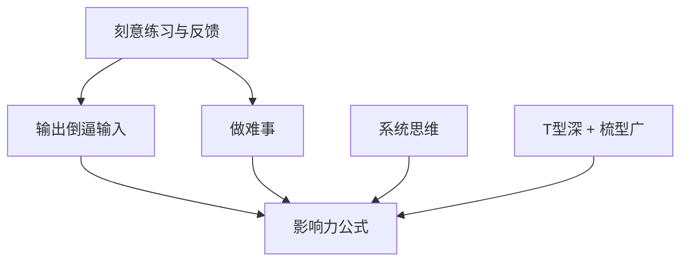

# 心法与原则索引

> 技术可以过时，心法永不过时。
> 大拿与普通人的差距，往往不在「知道多少」，而在于「用什么底层逻辑做决策」。

本索引收集那些被反复验证、可以指导 5-10 年职业生涯的**心智模型**与**原则**。

---

## 核心心法地图（推荐阅读顺序）

---

## 必读心法（v1 核心）

### 1. 刻意练习与及时反馈

- **一句话**：普通人靠天赋和重复，大拿靠刻意练习 + 即时、残酷的反馈。
- **核心洞见**：光「多写代码」不够，必须针对自己的薄弱环节设计练习，并找到能给你真实反馈的场景（开源、review、线上问题、教学）。
- **阅读入口**：[[刻意练习与及时反馈]]

**标签**：#心法/刻意练习 #心法/反馈 #阶段/全周期

---

### 2. 输出倒逼输入

- **一句话**：写出来、讲出来、开源出来，是最高效的深度理解方式。
- **核心洞见**：大拿几乎无一例外是高产出者。输出不是「锦上添花」，而是「理解的最后一公里」。
- **阅读入口**：[[输出倒逼输入]]

**标签**：#心法/输出 #影响力/写作 #影响力/开源

**真实案例**：[[左耳朵耗子]] 用 15 年持续写作证明了这个杠杆的威力；[[阮一峰]] 用系统化教育输出把「把复杂讲清楚」做成了长期影响力。

---

### 3. 做难事：突破舒适区

- **一句话**：业务代码永远是「小怪」，大拿是靠持续主动做「大怪」长大的。
- **核心洞见**：李运华反复强调「Do More + Do Better」。大多数人的天花板，不是能力，而是「选择」。
- **阅读入口**：[[做难事：突破舒适区]]

**标签**：#心法/勇气 #心法/选择 #阶段/3-7年

---

### 4. 系统思维与全链路视角

- **一句话**：从浏览器到数据库、从需求到上线、从代码到组织——大拿永远在更高的抽象层看问题。
- **核心洞见**：当你能把整个链路装进脑子里时，你的方案和判断力会发生质变。
- **阅读入口**：[[系统思维与全链路视角]]

**已上线**（2026-06）：完整高质量文章，强烈推荐与李运华、左耳朵耗子一起读。

### 7. 项目驱动学习法（新增）

- **一句话**：把真实工作项目当作最高质量的刻意练习场和全链路训练场。
- **核心洞见**：工作本身远比下班后的学习效率高，前提是你要主动选项目、设定学习目标、强制复盘。
- **阅读入口**：[[项目驱动学习法]]

**标签**：#心法/学习方法 #阶段/3-7年

**已上线**（2026-06）：完整文章，强烈建议与「做难事」「全链路视角」一起实践。

**标签**：#心法/系统思维 #心法/架构 #阶段/突破期

---

### 5. 影响力 = 深度 × 持续输出 × 连接

- **一句话**：影响力不是「人脉」，而是「别人在解决某个问题时，会不会想到你」。
- **核心洞见**：冯大辉、阮一峰、Carmack 等人的共同点——他们在某个垂直领域长期深耕 + 持续公开输出 + 主动连接社区。
- **阅读入口**：[[影响力 = 深度 × 持续输出 × 连接]]

**标签**：#心法/影响力 #影响力/品牌

---

### 6. T型深 + 梳型广（专家的形状）

- **一句话**：纯 T 型（一深到底）容易被时代淘汰，纯广容易浅；大拿是「T 底 + 多把梳子」。
- **核心洞见**：先在一个领域打到别人绕不开你，再横向迁移范式。
- **阅读入口**：[[T型深 + 梳型广]]

**标签**：#心法/专家形状 #心法/职业规划

**真实案例**：[[丁奇]] 把数据库内核（尤其是 InnoDB）深到极致，再横向迁移到分布式数据库领域；[[Rich Hickey]] 用「Simple Made Easy」重新定义了软件复杂度的哲学边界。

---

## 更多心法（规划中）

- 长期主义复利模型
- 独立思考与信息茧房对抗
- 技术人的产品感与商业理解
- 复盘的正确姿势（见 [[复盘三问法]]）
- 教是最好的学

**已上线（超级个体板块）**：
- [[如何成为技术超级个体]]（2026-06）

---

## AI 时代特有心法（2026新增）

AI 浪潮带来了全新变量：Scaling Law、算力基础设施、对齐/安全、研究-工程-产品高度融合的组织形态。这些心法专门针对 AI 从业者与想理解 AI 时代大拿的人。

### 1. Scaling Law 的哲学
- **一句话**：当计算、数据、模型规模按幂律扩展时，很多“聪明算法”会被简单暴力 scaling 超越（Rich Sutton《The Bitter Lesson》）。
- **核心洞见**：在 AI 时代，长期判断力比短期技巧更重要；要理解“什么会随 scale 自然涌现”，而不是只追当前 SOTA。
- **阅读入口**：[[Scaling Law 的哲学]]
- **相关人物**：[[Rich Sutton]] · [[Ilya Sutskever]] · [[Geoffrey Hinton]]

### 2. AI 对齐入门
- **一句话**：让超级智能系统“做人类真正想做的事”比单纯让它“更聪明”更难，也更关键。
- **核心洞见**：对齐不是事后补丁，而是与能力开发必须并行的工程与哲学问题。
- **阅读入口**：[[AI 对齐入门]]

### 3. AI 时代的组织能力
- **一句话**：AI 组织需要研究+工程融合、小而精高带宽团队、极快实验闭环、安全与能力并行、使命与商业动态平衡。
- **核心洞见**：顶级 AI 突破往往来自极小高密度团队 + 清晰北极星 + 允许快速失败的文化（DeepMind AlphaGo/AlphaFold、OpenAI 早期、Tesla FSD）。
- **阅读入口**：[[AI 时代的组织能力]]（已补充 DeepMind、OpenAI、Tesla、NVIDIA 实战案例）
- **相关人物**：[[Demis Hassabis]] · [[Sam Altman]] · [[Andrej Karpathy]] · [[Jensen Huang]]

### 4. AI 对齐的工程实践
- **一句话**：RLHF、Constitutional AI、过程监督、可扩展监督、红队测试等是当前把“对齐”从理念变成可执行工程的工具箱。
- **核心洞见**：对齐工程与模型训练必须并行，事后救火成本极高。
- **阅读入口**：[[AI 对齐的工程实践]]
- **相关人物**：[[Ilya Sutskever]] · [[Demis Hassabis]]

**标签**：#心法/AI时代 #心法/对齐 #心法/组织 #心法/Scaling

---

## 心法如何使用？

1. **抄到自己的卡片/第二大脑**：不要只在脑子里过一遍
2. **每周复盘一次**：问自己「本周我实践了哪一条心法？」
3. **与人物志结合读**：看李运华怎么实践「做难事」，看 Carmack 怎么实践「极致专注」

---

## 交叉引用

- 想找对应**实践方法** → [[复盘三问法]]（方法论与框架代表）
- 想看**真实人物**怎么落地这些心法 → [[人物索引]]
- 想找**分阶段行动指南** → [[路径索引]]

**本页维护者**：dana 项目
**最后更新**：2026-06（本轮人物案例交叉 + 健康检查同步）